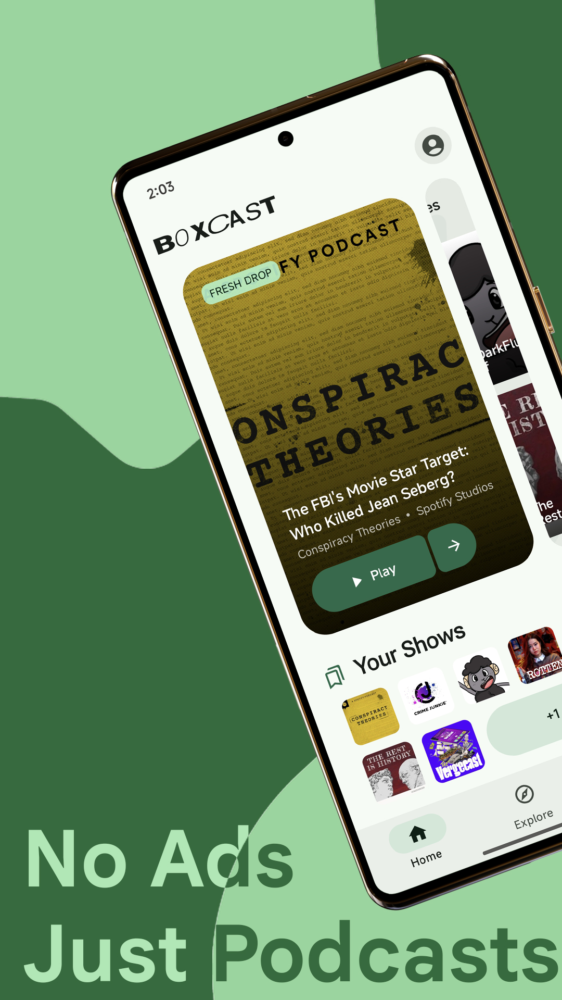
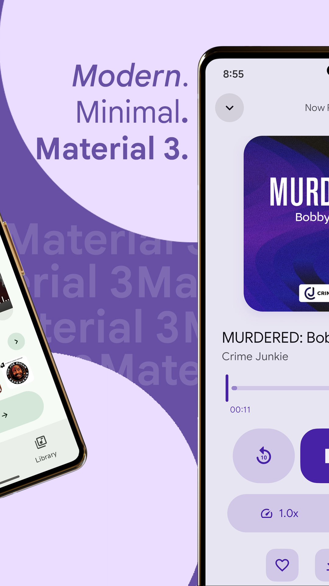
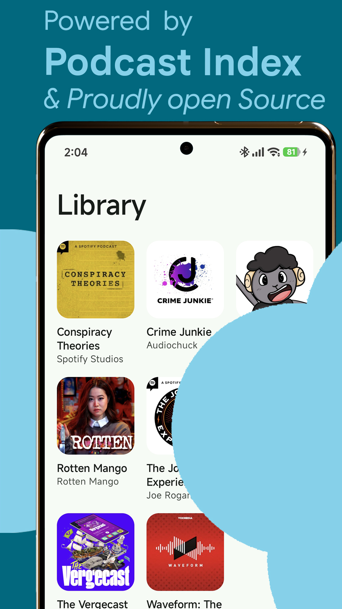

# BoxCast

[](https://kotlinlang.org/)
[](https://developer.android.com/jetpack/compose)
[](https://www.reddit.com/user/Altruistic_Plenty696)

*A premium podcast companion app for Android, built with Kotlin and Jetpack Compose.*

BoxCast focuses on clean design, fast discovery, and a playback experience that stays out of your way. It follows [Material 3 Expressive](https://m3.material.io/) guidelines — spring-based motion, dynamic color extraction, variable typography, and expressive shapes throughout.

---

## Features

### Home
- **Hero Carousel:** Spotlight trending podcasts with full-bleed artwork and one-tap playback.
- **Curated Time Blocks:** Morning, afternoon, and evening picks that adapt to when you open the app.
- **Your Shows:** New episodes from subscriptions, synced live via the Podcast Index API.
- **Smart Shuffle:** Resume listening with a mosaic grid of recently played and new episodes from your library.

### Player
- **Dynamic Theming:** Album art colors are extracted in real-time and applied to the entire player surface.
- **Sleep Timer:** Preset durations with a fade-out before stopping.
- **Variable Speed:** 0.5× to 3× with pitch correction.
- **Queue & Up Next:** Drag-to-reorder queue with mark-as-played and play-next actions.

### Discover & Explore
- **Genre Browsing:** Filter trending charts by category (News, Comedy, True Crime, etc.).
- **Hybrid Search:** Queries hit both the local edge database (for instant chart matches) and the Podcast Index API (for global coverage).

### Library
- **Offline Downloads:** Save episodes for offline listening with a background download service.
- **Listening History:** Full playback history with resume positions natively synced.

---

## Screenshots

<table align="center">
  <tr>
    <td align="center"><br/><sub><b>Discover Podcasts</b></sub></td>
    <td align="center"><br/><sub><b>Beautiful Player</b></sub></td>
    <td align="center"><br/><sub><b>Your Library</b></sub></td>
  </tr>
  <tr>
    <td align="center"><br/><sub><b>Smart Search</b></sub></td>
    <td align="center"><br/><sub><b>Material 3 Expressive</b></sub></td>
    <td></td>
  </tr>
</table>

---

## Getting Started & Downloads

You can try out BoxCast right now by downloading the latest APK!

**Download & Install:**
1. Head over to the **[Releases](../../releases/latest)** section on GitHub.
2. Download the `app-release.apk` file from the latest version.
3. Once downloaded, open it on your Android device (you may need to allow "Install from Unknown Sources").

**Build from Source:**

```bash
# Clone the repository
git clone https://github.com/ashwkun/box.cast.android.git

# Navigate into the directory
cd box.cast.android

# Build the debug APK
./gradlew assembleDebug
```

---

## Architecture & Tech Stack

Multi-module Gradle project following a feature-first architecture.

| Layer | Technology |
|-------|-----------|
| **Language** | Kotlin |
| **UI** | Jetpack Compose + Material 3 Expressive |
| **Image Loading** | Coil |
| **Networking** | Retrofit + kotlinx.serialization |
| **Local Database**| Room |
| **Playback** | Media3 / ExoPlayer |
| **Analytics** | Firebase Analytics + Crashlytics |

### Backend (Proxy)

A **Cloudflare Worker** (TypeScript) that sits between the Android app and the [Podcast Index API](https://podcastindex.org/):
- **Edge Database:** [Turso](https://turso.tech/) (distributed SQLite) stores chart rankings and podcast metadata.
- **Live Proxy:** Subscription sync (`/sync`) proxies directly to the Podcast Index for guaranteed freshness.
- **Data Pipeline:** A GitHub Actions workflow runs daily to scrape charts.

---

## License

This is a personal open-source fan project. All rights reserved.
