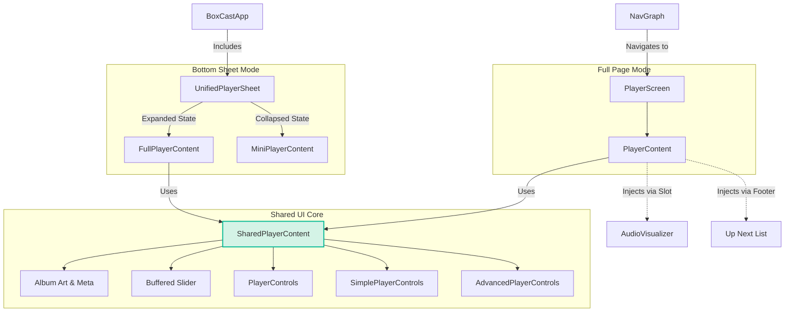

# Player Architecture

This document outlines the structure of the Player feature in BoxCast, highlighting how code is shared between the "Bottom Sheet" player and the "Full Screen" player.

## Component Hierarchy

The player is built around a **Single Source of Truth** for the UI: `SharedPlayerContent`.

## File Responsibilities

| File | Role | Description |
| :--- | :--- | :--- |
| **`UnifiedPlayerSheet.kt`** | **The Container** | The persistent Bottom Sheet that stays with the user. Handles the drag gestures and coordinates the expansion from Mini to Full player. |
| **`PlayerScreen.kt`** | **The Page** | The standalone screen for the player (e.g. via deep link). Handles the `AudioVisualizer` and `Up Next` list. |
| **`FullPlayerContent.kt`** | **Sheet Wrapper** | A thin wrapper for the expanded sheet. Handles system bar transparency and passing the adaptive color scheme. |
| **`SharedPlayerContent.kt`** | **The Core UI** | **(Refactored)** The main UI component containing the Artwork, Title, Slider, and Control buttons. It is used by *both* `FullPlayerContent` and `PlayerScreen` to ensure identical behavior. |
| **`MiniPlayerContent.kt`** | **Mini Wrapper** | The small bar visible when the player is collapsed. |
| **`PlayerControls.kt`** | **Buttons** | The core playback buttons (Play, Pause, Skip). |
| **`SimplePlayerControls.kt`** | **Modifiers** | The secondary controls: Playback Speed and Sleep Timer. |
| **`AdvancedPlayerControls.kt`** | **Actions** | The action buttons: Like, Download, and Queue. |
